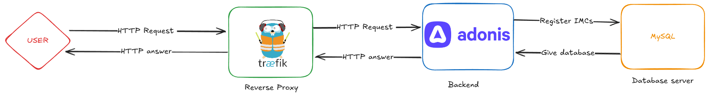
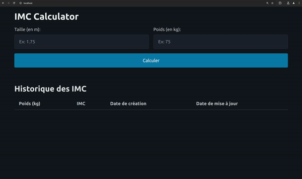

# Question 2

## Conception d'une application web de calcul d'IMC

### Choix des technologies

- **Frontend**: HTML, CSS, JavaScript, Edge.js
- **Backend**: Node.js (version 20 ou supérieure) avec TypeScript et AdonisJS
- **Base de données**: MySQL
- **Reverse proxy**: Traefik
- **Orchestration:** Docker-compose

### Architectutre


Cette architecture suit un modèle client-serveur classique avec une couche intermédiaire de reverse proxy. Un utilisateur (client) envoie une requête HTTP à un reverse proxy nommé Traefik. Ce proxy joue le rôle de "portier", distribuant les requêtes vers le service approprié.
Ici nous avons un unique service et donc transmet la requête à un backend. Ce dernier écrit en TypeScript avec le framework AdonisJS, traite la requête, interagit avec une base de données MySQL (pour enregistrer les IMCs) et renvoie une réponse HTTP à Traefik. Ce dernier transmet ensuite la réponse à l'utilisateur, finalisant ainsi le cycle de requête-réponse.

### Structure du projet

Le projet est structuré en plusieurs dossiers :

- **app:** Contient le code source de l'application (controllers, models, services, etc.).
- **config:** Contient les fichiers de configuration (variables d'environnement, etc.).
- **database:** Contient les migrations pour la création de la base de données.
- **public:** Contient les fichiers statiques (CSS, images, etc.).
- **resources:** Contient les vues (templates) de l'application.
- **start:** Contient les fichiers importants pour le démarrage de l'application.

### Installation

1. **Prérequis:**
   - Docker
   - Docker-compose
   - Git
2. **Cloner le dépôt:**
   ```bash
   git clone https://github.com/MatthieuFlaceliere/8INF876_TP-1
   cd 8INF876_TP-1/Q2
   ```
3. Lancez les conteneurs Docker :

   ```bash
   docker compose up -d
   ```

4. Executez les migrations pour créer la base de données :

   ```bash
   docker exec app node ace migration:run --force
   ```

L'application est maintenant accessible à l'adresse `http://localhost:80`.

### Utilisation

Accédez à la page principale.
Entrez votre taille (en mètres) et votre poids (en kilogrammes).
Cliquez sur "Calculer" pour obtenir votre IMC.
L'historique des calculs d'IMC sera affiché sous le formulaire.


### Eleves :

- Gaspard Audoux
- Matthieu Flacelière
